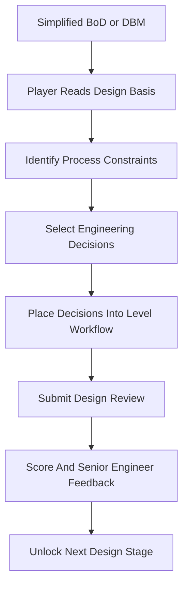

# Plant Operations Game Vault

This vault is the planning source for a chemical process engineering game about translating simplified design basis documents into early process design decisions.

#### Core Notes

- [[Vault Map]]
- [[Game Vision]]
- [[Game Modes and Scope]]
- [[Design Basis MVP]]
- [[First Plant Scope]]
- [[Chemical Engineering Decision Mapping]]
- [[Level Structure and Difficulty Modes]]
- [[Core Game Loop]]
- [[Player Experience Flow]]
- [[Stakeholder Handoff Model]]
- [[Plant Improvement Simulation]]
- [[Metrics and Formulas]]
- [[Scenario Data Schema]]
- [[Source of Truth]]
- [[Tech Stack Options]]
- [[Infrastructure Decisions]]
- [[Repository Structure]]
- [[AI and Content Pipeline]]
- [[Production Gantt Chart]]
- [[MVP Backlog]]
- [[Roadmap]]
- [[Domain Research Plan]]
- [[Open Questions]]

#### Working Principle

The MVP starts from a simplified Basis of Design or Design Basis Memorandum, not customer complaints or social media feedback.

The player acts as a junior process engineer for a small specialty chemical plant. They read feedstock specs, product targets, site constraints, utility limits, environmental rules, safety standards, and engineering codes. They then select the correct early design decisions for reactors, separation, heat transfer and utilities, process control and safety, and environmental treatment.

The larger plant-improvement simulation remains the long-term goal. The first playable version should teach the translation step from design basis language to process engineering decisions.

#### Map

#### Working Folders

| Folder | Purpose |
|---|---|
| `00-index` | Entry points, maps, and unresolved questions |
| `01-game-design` | Player experience, loop design, stakeholder model, modes, and scope |
| `02-simulation-model` | Plant model, metrics, formulas, data schema, and balance assumptions |
| `03-production-plan` | Gantt chart, roadmap, milestones, and MVP backlog |
| `04-tech-infrastructure` | Source of truth, stack options, repo structure, tooling, and pipeline decisions |
| `05-research` | Domain research, scenario references, interviews, and example cases |
| `06-decisions` | Architecture and product decision records |
| `templates` | Reusable note templates |
