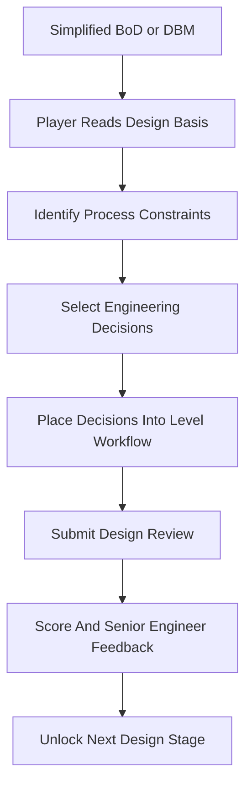

# Plant Operations Game Vault

This vault is the planning source for a chemical process engineering game about translating simplified design basis documents into early process design decisions.

#### Core Notes

- [[Vault Map]]
- [[Game Vision]]
- [[Game Modes and Scope]]
- [[Design Basis MVP]]
- [[First Plant Scope]]
- [[Chemical Engineering Decision Mapping]]
- [[Level Structure and Difficulty Modes]]
- [[Core Game Loop]]
- [[Player Experience Flow]]
- [[Stakeholder Handoff Model]]
- [[Plant Improvement Simulation]]
- [[Metrics and Formulas]]
- [[Scenario Data Schema]]
- [[Source of Truth]]
- [[Tech Stack Options]]
- [[Infrastructure Decisions]]
- [[Repository Structure]]
- [[AI and Content Pipeline]]
- [[Production Gantt Chart]]
- [[MVP Backlog]]
- [[Roadmap]]
- [[Domain Research Plan]]
- [[Open Questions]]

#### Working Principle

The MVP starts from a simplified Basis of Design or Design Basis Memorandum, not customer complaints or social media feedback.

The player acts as a junior process engineer for a small specialty chemical plant. They read feedstock specs, product targets, site constraints, utility limits, environmental rules, safety standards, and engineering codes. They then select the correct early design decisions for reactors, separation, heat transfer and utilities, process control and safety, and environmental treatment.

The larger plant-improvement simulation remains the long-term goal. The first playable version should teach the translation step from design basis language to process engineering decisions.

#### Current Prototype Status

The browser prototype now has an eight-mission easy-mode Solvex-A campaign scaffold, with Missions 1-3 reconciled for the current data model:

- dashboard-style mission screen with top header, level map, design basis excerpt, decision board, selected decision tray, objective strip, and senior engineer action bar
- design review completion screen with score summary, supported decisions, unsupported decisions, missed decisions, restart action, and gated continue action
- Mission 1: Decode The Design Basis
- Mission 2: The Reactor Runs Hot
- Mission 3: Separation Section
- Missions 4-8 are authored in easy mode as the remaining campaign scaffold
- Missions unlock on pass score, not perfect score
- Mission 2 includes reactor heat-removal, summer cooling-water limitation, temperature control, independent safety protection, and runaway/overpressure review decisions
- Mission 3 includes separation requirements, impurity/water removal, VLE/property-data gaps, temperature sensitivity, and wastewater routing decisions
- campaign-level progressive `bod_document` replaces per-mission `bod_excerpt`; `getBodForMission()` controls which BoD sections are visible and marks newly introduced sections
- dynamic mission header and level map state for current, completed, and locked missions
- pass-based continue action through `advanceToNextMission()`
- design decision cards sorted by display label order and shared presentation helpers
- selected decision tray and design review feedback now resolve labels from the same decision IDs
- design-basis excerpt renders progressive mission-specific sections instead of only Mission 1 BoD section names
- review score ring and metric cards have compact copy to avoid clipped text
- `NEW` badges identify BoD sections introduced in the current mission
- custom SVG icon set loaded from `src/assets/icons/plant-ops`
- deterministic scoring in `src/domain/scoring.ts`
- campaign YAML in `src/content/scenarios/solvex-a-campaign.yaml`
- campaign loader and validation in `src/content/loadCampaign.ts` and `src/domain/validateCampaign.ts`
- Zustand runtime state in `src/store/useGameStore.ts`
- tests covering scoring and campaign validation
- `.claude/` local worktrees are ignored and excluded from Vitest discovery

Current verification:

- `npm run test` passes with 61 tests
- `npm run build` passes

Git state note: Claude's eight-mission progressive BoD work is already on GitHub. Deepseek's local Mission 3 work has been reconciled into the current local branch but has not yet been committed or pushed.

The next product step is to playtest Missions 1-3 together and verify the mission unlock flow through Mission 4. Do not start another broad visual redesign before the three-mission loop is reviewed.

#### Map

#### Working Folders

| Folder | Purpose |
|---|---|
| `00-index` | Entry points, maps, and unresolved questions |
| `01-game-design` | Player experience, loop design, stakeholder model, modes, and scope |
| `02-simulation-model` | Plant model, metrics, formulas, data schema, and balance assumptions |
| `03-production-plan` | Gantt chart, roadmap, milestones, and MVP backlog |
| `04-tech-infrastructure` | Source of truth, stack options, repo structure, tooling, and pipeline decisions |
| `05-research` | Domain research, scenario references, interviews, and example cases |
| `06-decisions` | Architecture and product decision records |
| `scenarios` | Vault-side scenario drafts and source references |
| `templates` | Reusable note templates |
