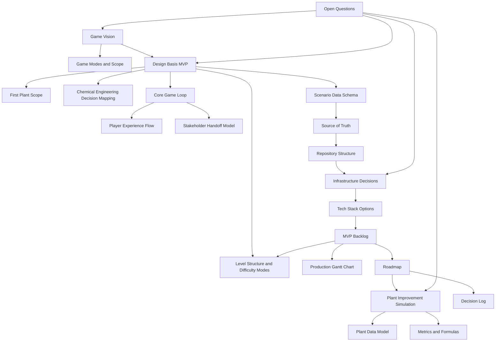

# Vault Map

#### Purpose

This note shows how the design files connect to the current browser prototype. Use it as the visual entry point in Obsidian graph view.

#### Concept Map

#### Main Path Through The Vault

1. Start with [[Game Vision]].
2. Read [[Design Basis MVP]].
3. Read [[First Plant Scope]] and [[Chemical Engineering Decision Mapping]].
4. Read [[Core Game Loop]] and [[Player Experience Flow]] through the Design Basis MVP lens.
5. Use [[Scenario Data Schema]] to define campaign YAML, missions, BoD sections, decision options, answer keys, explanations, scoring, and unlock rules.
6. Treat [[Plant Improvement Simulation]], [[Plant Data Model]], and [[Metrics and Formulas]] as long-term expansion notes.
7. Lock infrastructure thinking in [[Source of Truth]], [[Repository Structure]], and [[Infrastructure Decisions]].
8. Plan production through [[MVP Backlog]], [[Level Structure and Difficulty Modes]], [[Production Gantt Chart]], and [[Roadmap]].

#### Current Implementation Anchor

The active browser prototype is now a two-mission campaign in `src/content/scenarios/solvex-a-campaign.yaml`:

- Mission 1: Decode The Design Basis
- Mission 2: The Reactor Runs Hot

Use [[Scenario Data Schema]], [[MVP Backlog]], and [[Roadmap]] for the current implementation state before adding Mission 3.

#### Related Notes

- [[Home]]
- [[Open Questions]]
- [[Decision Log]]
