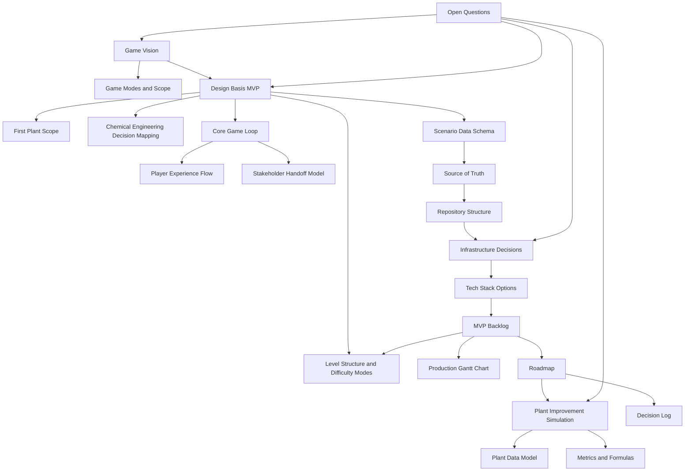

# Vault Map

#### Purpose

This note shows how the design files connect before code exists. Use it as the visual entry point in Obsidian graph view.

#### Concept Map

#### Main Path Through The Vault

1. Start with [[Game Vision]].
2. Read [[Design Basis MVP]].
3. Read [[First Plant Scope]] and [[Chemical Engineering Decision Mapping]].
4. Read [[Core Game Loop]] and [[Player Experience Flow]] through the Design Basis MVP lens.
5. Use [[Scenario Data Schema]] to define BoD sections, decision options, answer keys, and explanations.
6. Treat [[Plant Improvement Simulation]], [[Plant Data Model]], and [[Metrics and Formulas]] as long-term expansion notes.
7. Lock infrastructure thinking in [[Source of Truth]], [[Repository Structure]], and [[Infrastructure Decisions]].
8. Plan production through [[MVP Backlog]], [[Level Structure and Difficulty Modes]], [[Production Gantt Chart]], and [[Roadmap]].

#### Related Notes

- [[Home]]
- [[Open Questions]]
- [[Decision Log]]
