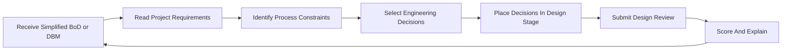

# Core Game Loop

#### Primary Loop

#### Loop Stages

##### 1. Design Basis Input

Inputs include simplified BoD or DBM sections such as feedstock requirements, product targets, utility availability, site constraints, environmental regulations, safety standards, and engineering codes.

##### 2. Requirement Reading

The player reads the design basis and identifies the key process requirements:

- purity target
- annual capacity
- flammability
- exothermic reaction behavior
- corrosive feed
- cooling water limitation
- VOC control requirement
- wastewater neutralization requirement

##### 3. Engineering Decision Selection

The player selects decisions in five MVP categories:

- reactor system
- separation system
- heat transfer and utilities
- process control and safety
- environmental treatment

##### 4. Stage Placement

The player places decisions into the current Gantt-style design stage, such as BoD review, reactor decision, separation decision, safety review, or PFD assembly.

##### 5. Design Review

The game scores the decision set and explains the technical logic.

##### 6. Senior Engineer Feedback

Feedback should feel like a design review comment, not a quiz answer. It should explain the relevant chemical engineering concept and why the selected decision fits or does not fit.

##### 7. Unlock

The player unlocks the next level or design artifact:

- PFD blocks
- equipment datasheet assumptions
- control checklist
- safety checklist
- environmental checklist

#### Related Notes

- [[Player Experience Flow]]
- [[Design Basis MVP]]
- [[First Plant Scope]]
- [[Level Structure and Difficulty Modes]]
- [[Plant Improvement Simulation]]
