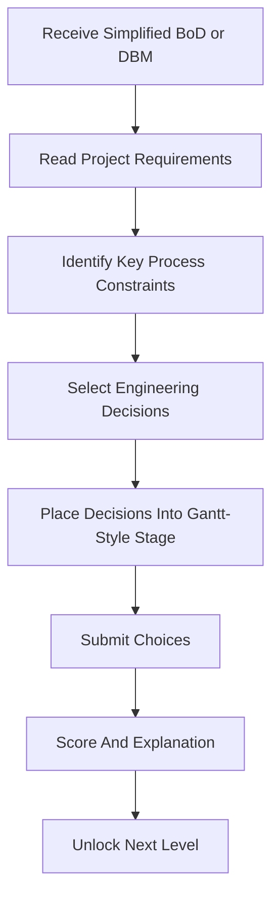

# Design Basis MVP

#### Purpose

This note defines the active MVP direction. It replaces the earlier customer-feedback House of Quality concept.

#### One-Line Pitch

A chemical process engineering game where the player reads a simplified Basis of Design or Design Basis Memorandum and converts it into correct early process design decisions for a specialty chemical plant.

#### Player Role

The player is a junior process engineer assigned to early-stage plant design.

The player does not operate the plant yet. Their job is to read the design basis and decide what belongs in the early process design package.

#### Input Document

Each level starts from a simplified BoD or DBM containing:

- feedstock requirements
- product targets
- operating constraints
- site limitations
- utility availability
- environmental regulations
- safety standards
- engineering codes and standards

#### MVP Output

The player converts the design basis into:

- process decision matrix
- simplified PFD block choices
- early equipment datasheet selections
- basic control and safety checklist
- environmental treatment choices

#### Core Loop

#### MVP Decision Scope

The MVP includes only:

1. reactor system
2. separation system
3. heat transfer and utilities
4. process control and safety
5. environmental treatment

#### Not In MVP

- full factory simulation
- real construction scheduling
- detailed P&ID drafting
- 3D modeling
- FEA
- detailed plant layout
- real financial modeling
- real-time operations

#### Design For Manufacturing, FEA, And 3D Modeling

Design for Manufacturing should appear only as a light process-design principle in the MVP:

- design for operability
- design for maintainability
- design for cleanability
- design for safe operation

FEA should not be included in the MVP. It is better suited to a later mechanical verification module.

3D modeling should not be a player task in the MVP. A simple 2D plant map or block diagram can be used as a visual reward.

#### Related Notes

- [[First Plant Scope]]
- [[Chemical Engineering Decision Mapping]]
- [[Level Structure and Difficulty Modes]]
- [[MVP Backlog]]
