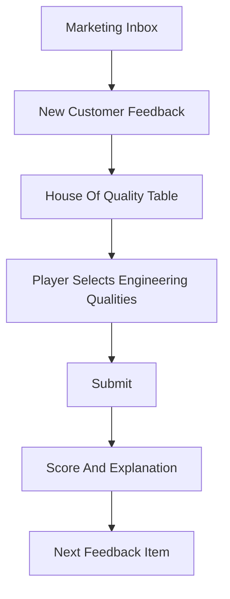

# House of Quality MVP

#### Status

Superseded by [[Design Basis MVP]].

#### Purpose

This note records the earlier MVP direction for context. The active MVP no longer starts from customer feedback or marketing. It starts from a simplified BoD or DBM and asks the player to make process engineering decisions.

#### Core Idea

The marketing team receives customer feedback. Each feedback item is automatically inserted into a House of Quality table as a customer need. The player must choose which engineering qualities correctly respond to that need.

#### Player Task

For each customer feedback item, the player:

- reads the customer voice
- identifies the underlying customer need
- reviews a list of engineering qualities
- ticks the engineering qualities that are relevant
- submits the selection
- receives scoring and explanation

#### Example

| Customer Feedback | Customer Need | Possible Engineering Qualities |
|---|---|---|
| "The product quality changes too much between batches." | Consistent output quality | process control accuracy, inspection frequency, raw material tolerance, equipment calibration |
| "We lose production time waiting for changeovers." | Faster changeover | setup time, cleaning time, modular tooling, scheduling flexibility |
| "Energy cost is making the product harder to justify." | Lower operating cost | energy intensity, heat recovery, motor efficiency, utility consumption |

#### MVP Screen Flow

#### House Of Quality Table Shape

| Customer Feedback | Customer Need | Engineering Quality A | Engineering Quality B | Engineering Quality C | Engineering Quality D |
|---|---|---|---|---|---|
| Feedback item | Interpreted need | checkbox | checkbox | checkbox | checkbox |

#### Scoring

The first scoring model can be simple:

- correct tick: +1
- missed correct quality: -1
- incorrect tick: -1
- perfect row: bonus +1

The explanation should tell the player why each selected or missed engineering quality matters.

#### MVP Data Needed

Each feedback item needs:

- customer feedback text
- interpreted customer need
- available engineering qualities
- correct engineering quality IDs
- short explanation for each correct answer
- short explanation for common wrong answers

#### Not In MVP

- plant network simulation
- capex decisions
- implementation downtime
- campaign progression
- financial modeling
- operations execution

#### Related Notes

- [[Core Game Loop]]
- [[MVP Backlog]]
- [[Scenario Data Schema]]
- [[Game Modes and Scope]]
