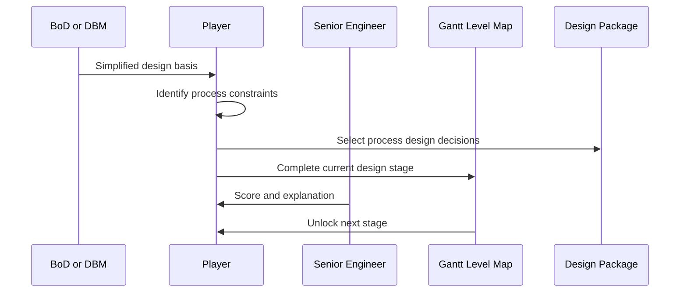

# Player Experience Flow

#### Session Structure

Each play session represents one design stage for the Solvex-A specialty chemical plant.

#### Flow

#### Player Decisions

- Which design basis clues matter?
- Which reactor system fits the process?
- Which separation method fits the product target?
- Which utility and heat transfer decisions are required?
- Which control and safety systems are necessary?
- Which environmental treatment choices are required?
- Which decisions are premature because data is missing?

#### Information Quality

Easy mode should provide clear information. Medium mode should introduce tradeoffs. Hard mode should introduce missing data and conditionally correct answers.

#### Related Notes

- [[Core Game Loop]]
- [[Design Basis MVP]]
- [[Level Structure and Difficulty Modes]]
- [[Infrastructure Decisions]]
