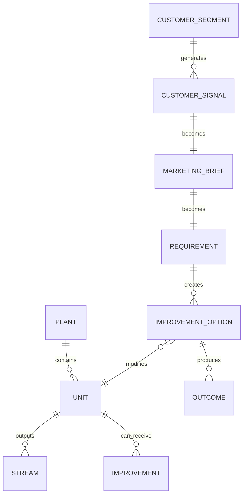

# Plant Data Model

#### Purpose

This note defines the early conceptual data model for representing full-scale production plants in the game.

#### Entity Map

#### Core Entities

| Entity | Description |
|---|---|
| Plant | A full production site with units, utilities, workforce, and constraints |
| Unit | A major process area, equipment group, or production cell |
| Stream | Material, utility, information, logistics, or quality flow |
| Customer signal | Raw customer request, complaint, or opportunity |
| Marketing brief | Interpreted business opportunity |
| Requirement | Product, capacity, quality, delivery, or compliance target |
| Improvement option | Technical or operational change the player can approve |
| Outcome | Market, financial, operational, and risk effect |

#### Early Attribute Types

- Numeric metrics: capacity, cost, yield, reliability, defect rate
- Categorical states: operating mode, product grade, risk level
- Constraints: budget, downtime window, utility limit, labor limit
- Relationships: bottleneck dependency, customer dependency, project dependency

#### Data Authoring Direction

The first prototype should keep this model small. A single plant with 5 to 8 units is enough to test whether the core loop is fun and understandable.

#### Related Notes

- [[Plant Improvement Simulation]]
- [[Source of Truth]]
- [[Starter Scenario - High-Purity Output Request]]

