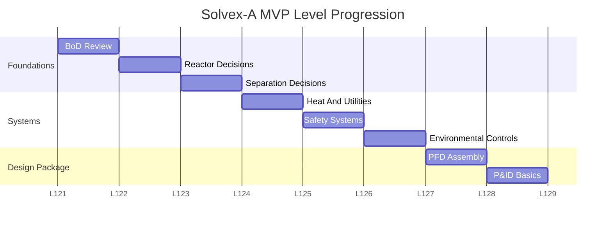

# Level Structure and Difficulty Modes

#### Purpose

This note defines level progression and difficulty for the Design Basis MVP.

#### Level Map

| Level | Stage | Main Document | Player Decision Focus | Unlocks |
|---:|---|---|---|---|
| 1 | Design Basis Review | Simplified BoD | Identify process requirements | Basic PFD blocks |
| 2 | Reaction Section | Reactor design note | Choose reactor and control needs | Reactor datasheet |
| 3 | Separation Section | Product specification | Choose separation method | Separator datasheet |
| 4 | Heat And Utilities | Utility constraints | Choose heating/cooling systems | Utility summary |
| 5 | Safety Review | Safety design basis | Choose interlocks and relief systems | Safety checklist |
| 6 | Environmental Review | Regulation summary | Choose wastewater and VOC controls | Environmental checklist |
| 7 | PFD Assembly | Process block list | Assemble simplified PFD | Draft PFD |
| 8 | P&ID Basics | Instrument requirement list | Select key instruments and alarms | Simplified P&ID layer |

#### Gantt-Style Level Structure

| Stage | L1 | L2 | L3 | L4 | L5 | L6 | L7 | L8 |
|---|---|---|---|---|---|---|---|---|
| BoD Review | XXX |  |  |  |  |  |  |  |
| Reactor Decisions |  | XXX |  |  |  |  |  |  |
| Separation Decisions |  |  | XXX |  |  |  |  |  |
| Heat And Utilities |  |  |  | XXX |  |  |  |  |
| Safety Systems |  |  |  |  | XXX |  |  |  |
| Environmental Controls |  |  |  |  |  | XXX |  |  |
| PFD Assembly |  |  |  |  |  |  | XXX |  |
| P&ID Basics |  |  |  |  |  |  |  | XXX |

#### Mermaid Gantt Draft

#### Easy Mode

Purpose: teach direct mapping from design basis to engineering decision.

Features:

- short BoD
- obvious clues
- few engineering choices
- 4 to 6 options per decision
- explanations after every decision
- no ambiguous constraints
- light over-selection penalty

#### Medium Mode

Purpose: teach tradeoffs.

Features:

- longer BoD
- plausible wrong answers
- multiple correct answers
- competing constraints
- score penalizes both missed and over-selected decisions
- short hints during play and full explanation after submission

#### Hard Mode

Purpose: teach process judgment under incomplete information.

Features:

- ambiguous design basis
- missing data
- conflicting requirements
- player can flag assumptions
- some decisions are conditionally correct
- no full feedback until design review
- strict penalty for over-selection and unsupported assumptions

#### Gameplay Model By Mode

| Mode | Decision Input | Feedback Timing | Penalty Style |
|---|---|---|---|
| Easy | Checkboxes or simple cards | Immediate explanation after each decision | Light penalty |
| Medium | Cards grouped by category | Short hints during play, full review after submission | Balanced penalty |
| Hard | Cards plus missing-data flag | Full feedback only after design review | Strong penalty for over-selection and unsupported assumptions |

#### Scoring Recommendation

| Action | Easy | Medium | Hard |
|---|---:|---:|---:|
| Correct selection | +1 | +1 | +1 |
| Missed required decision | -0.5 | -1 | -1 |
| Incorrect over-selection | -0.25 | -1 | -1.5 |
| Correct missing-data flag | +0.5 | +1 | +1 |
| Unsupported missing-data flag | 0 | -0.5 | -1 |
| Perfect level bonus | +1 | +1 | +2 |

#### Fun Layer

Use mission framing instead of plain quizzes:

- Mission 1: Decode The Design Basis
- Mission 2: The Reactor Runs Hot
- Mission 3: The Purity Crisis
- Mission 4: Summer Cooling Water Shortage
- Mission 5: The VOC Audit
- Mission 6: Design Review Boss Fight

#### Related Notes

- [[Design Basis MVP]]
- [[MVP Backlog]]
- [[Production Gantt Chart]]
