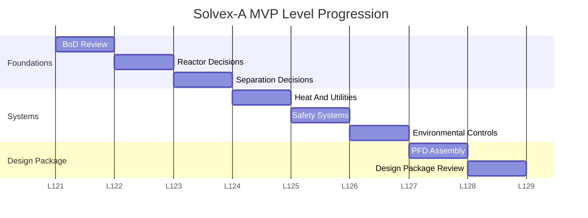

# Level Structure and Difficulty Modes

#### Purpose

This note defines level progression and difficulty for the Design Basis MVP.

#### Level Map

| Level | Stage | Main Document | Player Decision Focus | Unlocks |
|---:|---|---|---|---|
| 1 | Design Basis Review | Simplified BoD | Identify process requirements and reject unsupported over-design | Early design requirements |
| 2 | Reaction Section | Reactor design note | Define reactor heat-removal and temperature-control requirements | Reactor section basis |
| 3 | Separation Section | Product specification | Choose justified separation requirements without over-specifying equipment | Separation train outline |
| 4 | Heat And Utilities | Utility constraints | Resolve steam, cooling-water, and heat-removal constraints | Utility requirement list |
| 5 | Control And Safety Review | Safety/control basis | Match constraints to controls, alarms, relief, and flammable-feed safeguards | Control and safety basis |
| 6 | Environmental Review | Regulation summary | Choose wastewater and VOC controls | Environmental treatment basis |
| 7 | Basic PFD Assembly | Approved section decisions | Assemble simplified PFD blocks from prior mission outputs | Draft PFD block sequence |
| 8 | Design Package Review | Simplified design package | Find inconsistencies and omissions in the junior design package | Approved next-phase package |

#### Gantt-Style Level Structure

| Stage | L1 | L2 | L3 | L4 | L5 | L6 | L7 | L8 |
|---|---|---|---|---|---|---|---|---|
| BoD Review | XXX |  |  |  |  |  |  |  |
| Reactor Decisions |  | XXX |  |  |  |  |  |  |
| Separation Decisions |  |  | XXX |  |  |  |  |  |
| Heat And Utilities |  |  |  | XXX |  |  |  |  |
| Safety Systems |  |  |  |  | XXX |  |  |  |
| Environmental Controls |  |  |  |  |  | XXX |  |  |
| PFD Assembly |  |  |  |  |  |  | XXX |  |
| Design Package Review |  |  |  |  |  |  |  | XXX |

#### Mermaid Gantt Draft

#### Current Mission Flow Plan

The first six missions should mostly use decision/review gameplay. Mission 7 should change interaction style into simplified block assembly. Mission 8 should be a capstone design package review, not full P&ID drafting.

| Mission | Working Title | Gameplay Style | Output |
|---:|---|---|---|
| 1 | Decode The Design Basis | Select decisions directly implied by BoD clues | Approved early design requirements |
| 2 | The Reactor Runs Hot | Select reactor heat-removal, utility, and control decisions | Reactor section basis |
| 3 | Separation Section | Select required separations and flag over-specific technology choices | Separation train outline |
| 4 | Heat & Utilities | Match utility constraints to process needs | Heat and utility requirement list |
| 5 | Control & Safety Review | Match hazards and limits to controls, alarms, relief, and safeguards | Control and safety basis |
| 6 | Environmental Review | Match waste/emission streams to treatment requirements | Environmental treatment basis |
| 7 | Basic PFD Assembly | Arrange simplified process blocks unlocked by prior missions | Draft PFD block sequence |
| 8 | Design Package Review | Find inconsistencies and missing requirements in a simplified package | Approved junior design package |
 
Mission 8 should avoid full P&ID drafting. It may include basic instrument and safeguard recognition, but the player task is package review and inconsistency detection.

#### Easy Mode

Purpose: teach direct mapping from design basis to engineering decision.

Features:

- short BoD
- obvious clues
- few engineering choices
- 4 to 6 options per decision
- explanations after every decision
- no ambiguous constraints
- light over-selection penalty

#### Medium Mode

Purpose: teach tradeoffs.

Features:

- longer BoD
- plausible wrong answers
- multiple correct answers
- competing constraints
- score penalizes both missed and over-selected decisions
- short hints during play and full explanation after submission

#### Hard Mode

Purpose: teach process judgment under incomplete information.

Features:

- ambiguous design basis
- missing data
- conflicting requirements
- player can flag assumptions
- some decisions are conditionally correct
- no full feedback until design review
- strict penalty for over-selection and unsupported assumptions

#### Gameplay Model By Mode

| Mode | Decision Input | Feedback Timing | Penalty Style |
|---|---|---|---|
| Easy | Checkboxes or simple cards | Immediate explanation after each decision | Light penalty |
| Medium | Cards grouped by category | Short hints during play, full review after submission | Balanced penalty |
| Hard | Cards plus missing-data flag | Full feedback only after design review | Strong penalty for over-selection and unsupported assumptions |

#### Scoring Recommendation

| Action | Easy | Medium | Hard |
|---|---:|---:|---:|
| Correct selection | +1 | +1 | +1 |
| Missed required decision | -0.5 | -1 | -1 |
| Incorrect over-selection | -0.25 | -1 | -1.5 |
| Correct missing-data flag | +0.5 | +1 | +1 |
| Unsupported missing-data flag | 0 | -0.5 | -1 |
| Perfect level bonus | +1 | +1 | +2 |

#### Fun Layer

Use mission framing instead of plain quizzes:

- Mission 1: Decode The Design Basis
- Mission 2: The Reactor Runs Hot
- Mission 3: Separation Section
- Mission 4: Heat & Utilities
- Mission 5: Control & Safety Review
- Mission 6: Environmental Review
- Mission 7: Basic PFD Assembly
- Mission 8: Design Package Review

#### Current Implemented Missions

| Mission | Runtime Status | Content Notes | Unlock Rule |
|---:|---|---|---|
| 1 | Playable/current at campaign start | 17 decision cards: 10 correct, 7 wrong-plausible | 70% pass unlocks Mission 2 |
| 2 | Playable/locked at campaign start | 15 decision cards: 9 correct, 6 wrong-plausible; exothermic reactor, summer cooling-water limit, normal control vs independent safety protection | 70% pass unlocks Mission 3 |
| 3 | Playable/locked at campaign start, reconciled locally | 16 decision cards: 9 correct, 7 wrong-plausible; separation requirements, impurity/water removal, property-data gaps, temperature sensitivity, wastewater routing | 70% pass unlocks Mission 4 |
| 4-8 | Authored/locked scaffold | Easy-mode campaign content exists; needs playtest and polish after Missions 1-3 are proven | Chained 70% pass unlocks |

The current UI supports chained mission flow. Level map items can show current, completed, and locked states. Continue from the design review uses pass status, not perfect status.

Decision cards are sorted by category display label and card display label. The current category display order is alphabetical by displayed label, including Advanced, Control, Environment, Materials, Separation, and Utilities.

#### Related Notes

- [[Design Basis MVP]]
- [[MVP Backlog]]
- [[Production Gantt Chart]]
