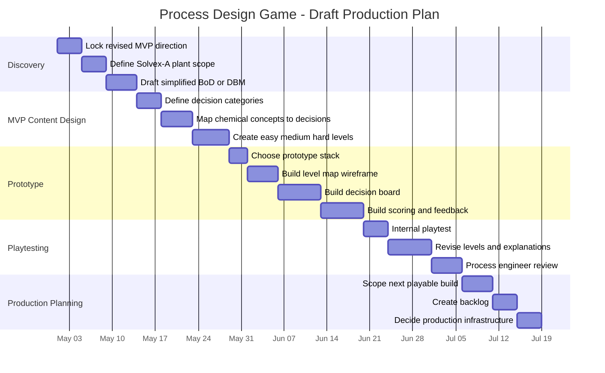

# Production Gantt Chart

#### Draft Production Plan

#### Milestone Definition

| Milestone | Definition |
|---|---|
| Concept locked | Design Basis MVP and Solvex-A plant scope are stable |
| First level defined | One simplified BoD stage can be played on paper |
| Decision prototype | Player can select process decisions and receive deterministic scoring |
| Vertical slice | Player can complete BoD review through one design stage with feedback |
| MVP scope | Features required for first public or classroom release are defined |

#### Related Notes

- [[Infrastructure Decisions]]
- [[Level Structure and Difficulty Modes]]
- [[Open Questions]]
- [[Decision Log]]
