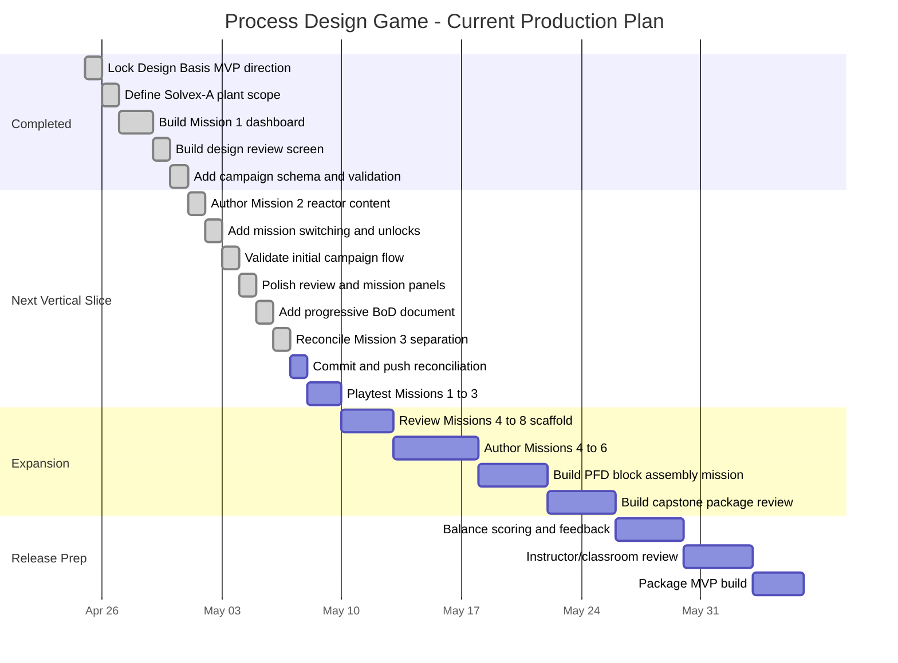

# Production Gantt Chart

#### Draft Production Plan

The browser prototype has completed the first playable three-mission local loop: Mission 1, Mission 2, reconciled Mission 3, campaign schema, progressive BoD, campaign validation, pass-based unlock, and mission-to-mission progression. The next production focus is committing/pushing the local reconciliation and playtesting Missions 1-3.

#### Milestone Definition

| Milestone | Definition |
|---|---|
| Concept locked | Design Basis MVP and Solvex-A plant scope are stable |
| Mission 1 playable | Player can complete BoD review, submit decisions, and receive senior engineer feedback |
| Campaign schema ready | Runtime campaign YAML loads through validation and supports multiple missions |
| Two-mission vertical slice | Player can complete Mission 1, unlock Mission 2, and continue into reactor-section content |
| Three-mission playtest ready | Mission 1, Mission 2, and Mission 3 pass tests/build and are ready for informal playtest |
| MVP campaign playable | Missions 1-8 are playable with appropriate interaction variety |
| MVP release candidate | Features required for first classroom release are defined, tested, and packaged |

#### Related Notes

- [[Infrastructure Decisions]]
- [[Level Structure and Difficulty Modes]]
- [[Open Questions]]
- [[Decision Log]]
