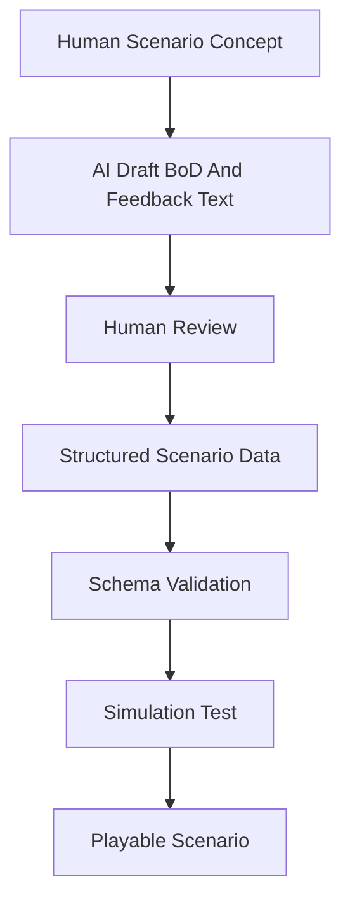

# AI and Content Pipeline

#### Purpose

This note defines where AI can help without becoming the source of truth.

#### Principle

AI can generate draft language, scenario variants, customer phrasing, and explanation text. It should not silently invent simulation truth, plant parameters, safety consequences, or domain claims.

#### Candidate Uses

| Use | Safe Role | Guardrail |
|---|---|---|
| BoD or DBM wording | Rewrite authored design basis facts into clearer level text | Keep structured scenario data fixed |
| Senior engineer feedback | Draft explanation text for correct and incorrect decisions | Require human review |
| Mission framing | Make levels feel playful without changing technical facts | Do not invent constraints |
| Scenario brainstorming | Generate candidate plant situations | Convert to reviewed structured data |
| Difficulty variants | Create easy, medium, and hard versions | Preserve answer-key logic |

#### Pipeline

#### Questions

- Should AI be used only during authoring, or also during gameplay?
- If used during gameplay, which BoD facts and answer keys must be locked before generation?
- Should hard mode use AI to generate plausible missing-data prompts?

#### Related Notes

- [[Source of Truth]]
- [[Scenario Data Schema]]
- [[Open Questions]]
