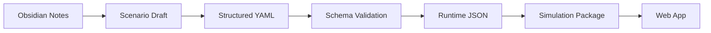

# Repository Structure

#### Purpose

This note records the repository layout for the current browser prototype and the intended direction once the project needs multiple packages.

#### Current Layout

```text
plant-ops-game/
  README.md
  package.json
  package-lock.json
  index.html
  vite.config.ts
  tsconfig*.json

  src/
    app/
    assets/
      icons/
        plant-ops/
      images/
    components/
    content/
      scenarios/
    domain/
    features/
      design-review/
      mission-dashboard/
      mission-flow/
    store/
    styles/
    tests/

  plant-ops-game-vault/
    00-index/
    01-game-design/
    02-simulation-model/
    03-production-plan/
    04-tech-infrastructure/
    05-research/
    06-decisions/
    scenarios/
    templates/
```

#### Current Ownership

| Area | Purpose |
|---|---|
| `src/app` | App shell and route-level screen selection |
| `src/assets` | Runtime images, icons, and other visual assets |
| `src/components` | Shared UI components used by multiple features |
| `src/content` | Runtime scenario content and loaders |
| `src/domain` | Pure game logic, scoring, scenario types, and later validation helpers |
| `src/features` | React UI grouped by gameplay area |
| `src/store` | Runtime game state |
| `src/styles` | Global CSS and later design tokens |
| `src/tests` | Unit tests |
| `plant-ops-game-vault` | Human-readable design source, plans, ADRs, and scenario drafts |

#### Current Rules

- Keep deterministic scoring and scenario interpretation in `src/domain`.
- Keep campaign YAML loaded by the browser prototype in `src/content/scenarios`.
- Keep planning notes, ADRs, and authoring drafts in `plant-ops-game-vault`.
- Use `src/features` for larger UI areas instead of growing a flat `screens` folder.
- Promote components to `src/components` only when they are used across multiple features.
- Avoid a backend until the first playable loop is proven.
- Keep custom app icons in `src/assets/icons/plant-ops`.
- Validate campaign YAML at load time before app state is created.

#### Current Runtime Files

| File | Purpose |
|---|---|
| `src/content/scenarios/solvex-a-campaign.yaml` | Runtime campaign data for Missions 1 and 2, and future missions |
| `src/content/loadCampaign.ts` | YAML parser and validation entrypoint |
| `src/content/loadScenario.ts` | Compatibility wrapper for Mission 1 |
| `src/domain/scenarioTypes.ts` | Campaign, mission, decision, scoring, and unlock types |
| `src/domain/validateCampaign.ts` | Lightweight campaign validation |
| `src/domain/scoring.ts` | Deterministic scoring |
| `src/store/useGameStore.ts` | Campaign, current mission, selected decisions, score result, and screen state |
| `src/features/mission-dashboard/decisionPresentation.ts` | Shared decision display labels, category labels, and sort order |
| `src/features/mission-dashboard/DesignBasisPanel.tsx` | Design basis excerpt renderer with support for Mission 1 and Mission 2 section keys |
| `src/features/design-review/DesignReviewCompleteScreen.tsx` | Review summary, senior engineer feedback, pass-based continue, and mission advancement |

Current runtime note: `src/content/scenarios/solvex-a-campaign.yaml` now contains Missions 1 and 2. `src/content/scenarios/solvex-a-level-1.yaml` remains a legacy duplicate and should not be treated as the active runtime source.

#### Future Layout

Move to this shape only when shared packages or multiple apps become necessary:

```text
plant-ops-game/
  docs/
    obsidian-vault/
  apps/
    web/
  packages/
    simulation/
    scenario-schema/
    scenario-content/
  tests/
    fixtures/
  tools/
    validate-scenarios/
```

#### Ownership

| Area | Owner Role | Purpose |
|---|---|---|
| `docs/obsidian-vault` | Designer, domain lead, producer | Human-readable design source |
| `packages/scenario-content` | Scenario author | YAML or JSON scenario data |
| `packages/scenario-schema` | Engineer | Validation schema and type generation |
| `packages/simulation` | Simulation engineer | Deterministic model and tests |
| `apps/web` | Product engineer | Playable browser prototype |
| `tools` | Build engineer | Content validation and conversion tools |

#### Data Flow



#### Early Rule

Do not let the first prototype depend on a complex backend. The simulation should run locally and deterministically until the loop is proven.

#### Related Notes

- [[Source of Truth]]
- [[Tech Stack Options]]
- [[Infrastructure Decisions]]
- [[Scenario Data Schema]]
