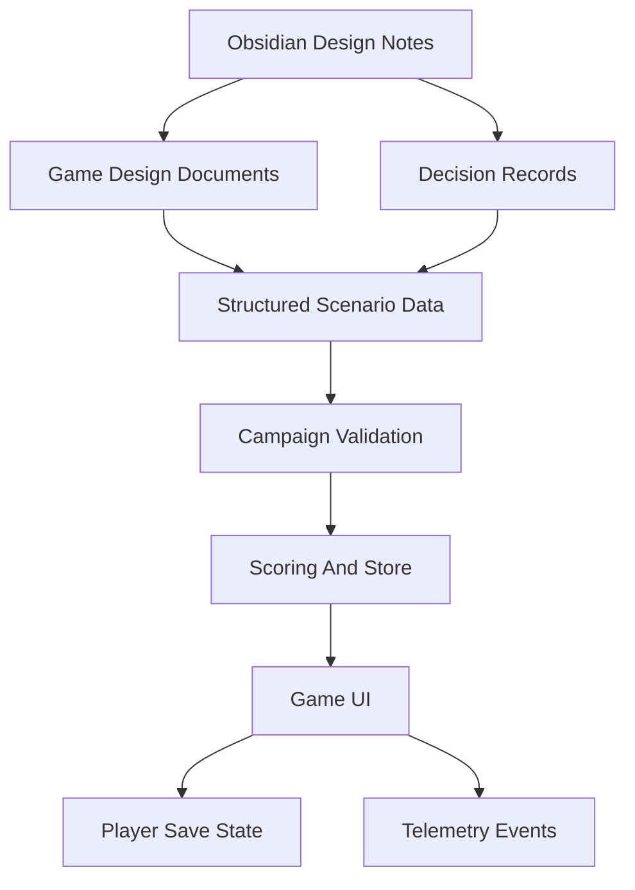

# Source of Truth

#### Decision

The source of truth is split between human-readable planning notes and validated runtime content.

Current split:

- Design truth: Obsidian Markdown notes in `plant-ops-game-vault`
- Runtime campaign truth: validated YAML in `src/content/scenarios/solvex-a-campaign.yaml`
- Domain truth: TypeScript types, scoring, and validation in `src/domain`
- Runtime state truth: Zustand store in `src/store/useGameStore.ts`
- Analytics truth: future event logs or playtest telemetry

The Obsidian vault records intent, scope, teaching goals, and design decisions. The browser app runs from validated YAML under `src/content/scenarios`.

#### Proposed Content Layers

#### Early File Types

| Layer | Format | Reason |
|---|---|---|
| Notes | Markdown | Easy linking and review |
| Diagrams | Mermaid in Markdown | Works in Obsidian and Git |
| Decisions | ADR Markdown | Clear history of tradeoffs |
| Scenario data | YAML or JSON | Readable, versionable, easy to validate |
| Simulation data | JSON or SQLite | Good for deterministic testing |
| Save state | JSON initially | Simple debugging |
| Telemetry | JSONL or database table | Event stream friendly |

#### Important Rule

Every number used in the simulation should eventually have a documented source, even if the first source is a design estimate.

Current runtime rule: use `src/content/scenarios/solvex-a-campaign.yaml` as the app content source. It now contains Mission 1 and Mission 2. Vault scenario files and `src/content/scenarios/solvex-a-level-1.yaml` are drafts, references, or legacy compatibility files until copied into the validated runtime YAML.

The active campaign workflow is:

- Author or edit mission content in `solvex-a-campaign.yaml`.
- Validate through `loadSolvexCampaign()` and `validateCampaign()`.
- Keep `loadSolvexLevelOne()` only as a compatibility wrapper for older Mission 1 tests/components.
- Use tests/build as the acceptance gate before treating YAML changes as playable.

#### Related Notes

- [[Infrastructure Decisions]]
- [[Tech Stack Options]]
- [[Decision Log]]
