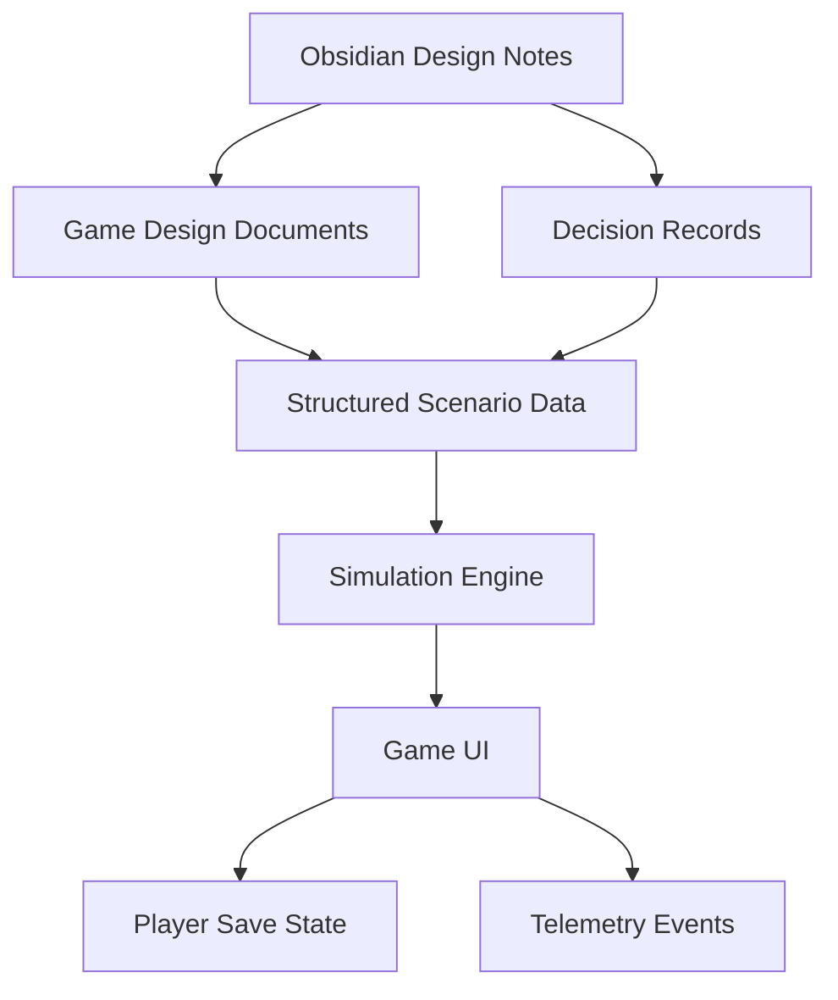

# Source of Truth

#### Decision

The initial source of truth should be human-readable Markdown and structured data stored in the repository. Obsidian is the design source of truth before code exists.

When implementation begins, the game should separate:

- Design truth: Obsidian Markdown notes
- Simulation truth: versioned JSON, YAML, or database seed data
- Runtime truth: application state and save files
- Analytics truth: event logs and playtest telemetry

#### Proposed Content Layers

#### Early File Types

| Layer | Format | Reason |
|---|---|---|
| Notes | Markdown | Easy linking and review |
| Diagrams | Mermaid in Markdown | Works in Obsidian and Git |
| Decisions | ADR Markdown | Clear history of tradeoffs |
| Scenario data | YAML or JSON | Readable, versionable, easy to validate |
| Simulation data | JSON or SQLite | Good for deterministic testing |
| Save state | JSON initially | Simple debugging |
| Telemetry | JSONL or database table | Event stream friendly |

#### Important Rule

Every number used in the simulation should eventually have a documented source, even if the first source is a design estimate.

#### Related Notes

- [[Infrastructure Decisions]]
- [[Tech Stack Options]]
- [[Decision Log]]

